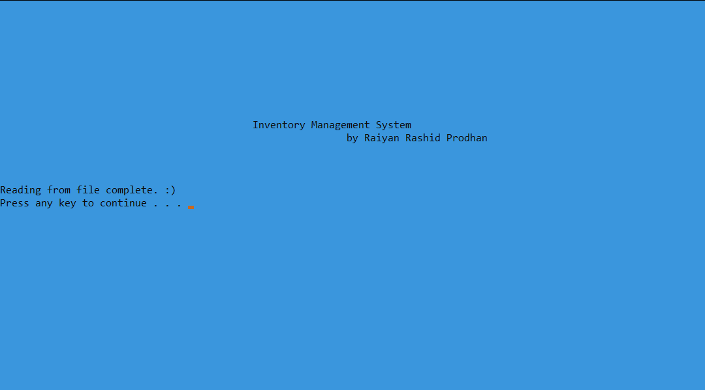
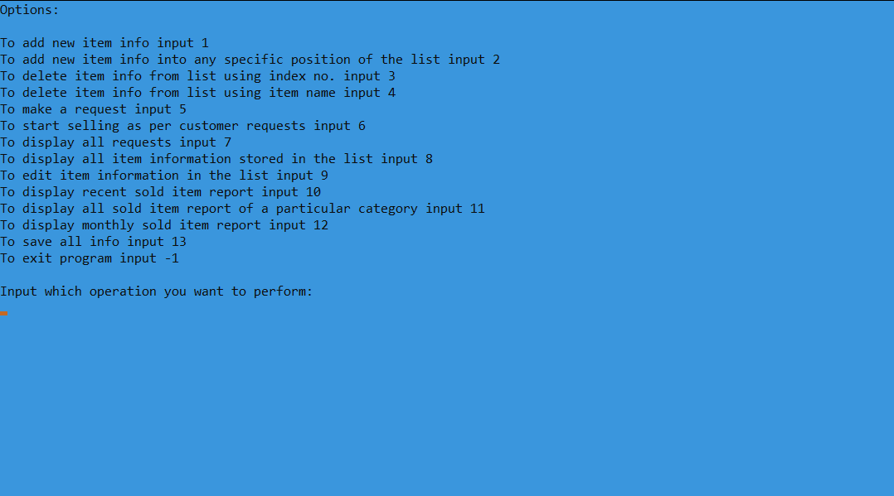

# inventory-management-system
An inventory management system built using C++ programming language, linked lists, queues and stacks.  
The main purose of building this application was to get comfortable with using different types of data structures.    

To use the application, simply download the "inventory management system.exe" file, run and enjoy!

### Screenshots of the application
#### Title Page

#### Home Page

